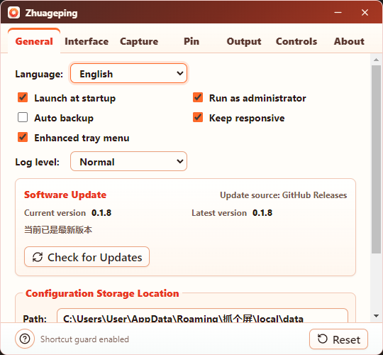
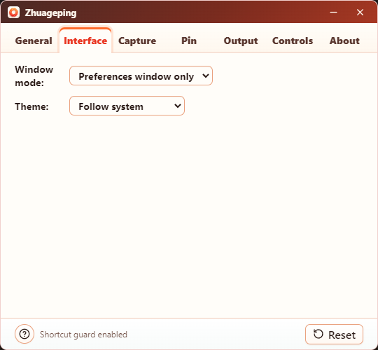
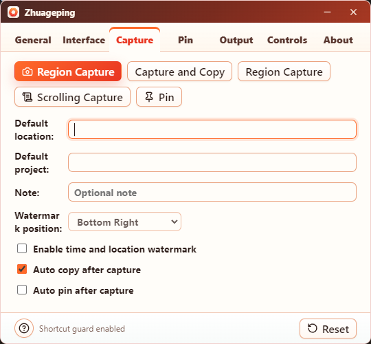
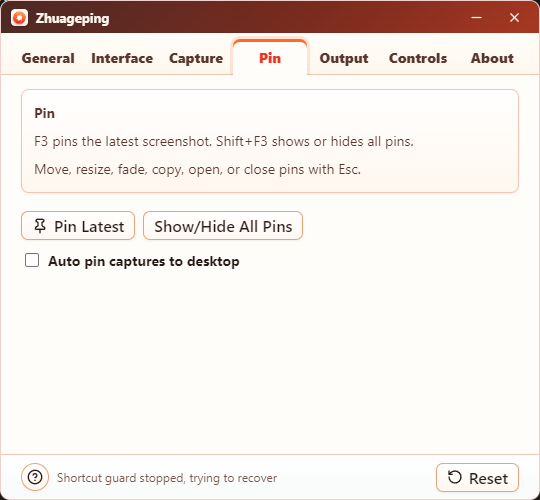
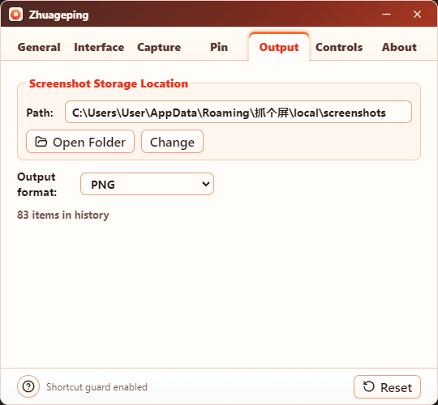
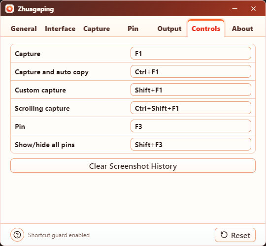
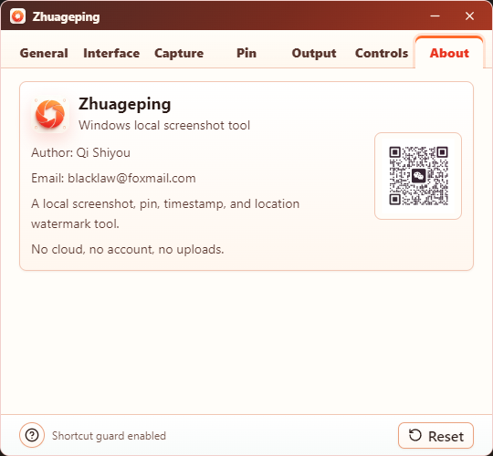
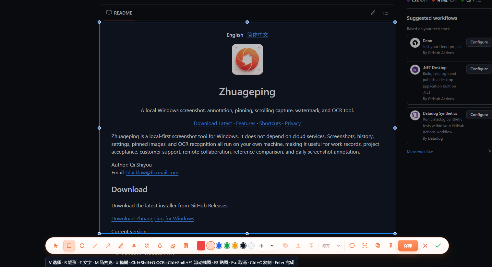

<p align="center">
  <strong>English</strong>
  ·
  <a href="README.zh-CN.md">简体中文</a>
</p>

<p align="center">
  
</p>

<h1 align="center">Zhuageping</h1>

<p align="center">
  A local Windows screenshot, annotation, pinning, screen recording, scrolling capture, watermark, and OCR tool.
</p>

<p align="center">
  <a href="https://github.com/ShiyouQi888/zhuageping/releases/latest">Download Latest</a>
  ·
  <a href="#core-features">Features</a>
  ·
  <a href="#screenshots">Screenshots</a>
  ·
  <a href="#default-shortcuts">Shortcuts</a>
  ·
  <a href="#privacy">Privacy</a>
</p>

Zhuageping is a local-first screenshot and screen recording tool for Windows. It does not depend on cloud services. Screenshots, recordings, history, settings, pinned images, and OCR recognition all stay on your own machine, making it useful for work records, project acceptance, customer support, remote collaboration, reference comparison, and daily annotation.

Author: Qi Shiyou  
Email: blacklaw@foxmail.com

## Download

Download the latest installer from GitHub Releases:

[Download Zhuageping for Windows](https://github.com/ShiyouQi888/zhuageping/releases/latest)

Current version:

- Version: `0.1.18`
- Platform: Windows x64
- Installer: `zhuageping-Setup-0.1.18-x64.exe`
- SHA256: `BEB2D91B64CE8175A1580B67C2C1D199F6DC8EEB759794550E0DC4DC5CA6F20B`
- Release: [Zhuageping v0.1.18](https://github.com/ShiyouQi888/zhuageping/releases/tag/v0.1.18)

Note: the current installer is not signed with a commercial code-signing certificate. Windows may show an unknown publisher warning during installation. This is expected for an unsigned installer and does not mean the app connects to the cloud or uploads your data.

## Latest Updates

Highlights in `v0.1.18`:

- Reorganized preferences into clearer Startup & Runtime, Software Update, Advanced Settings, Language & Appearance, and Window Behavior sections.
- Reduced the preferences window width while retaining complete Chinese and English labels and scrollable content.
- Consolidated screenshot and recording storage locations, formats, and history information in the Output tab.
- Removed the duplicate recording-folder action from the Record tab.
- Software Update no longer shows an update-source label and now displays the GitHub Release notes directly in the app.
- The restart-to-install prompt includes the release notes, so users can review changes before applying an update.
- Fixed update-state races that could leave a completed manual check showing “Checking for updates.”
- Fixed settings cards being compressed and clipped when their content exceeds the available window height.

## Screenshots

### Preferences

<table>
  <tr>
    <td width="50%"></td>
    <td width="50%"></td>
  </tr>
  <tr>
    <td align="center"><strong>General and software update</strong></td>
    <td align="center"><strong>Interface and theme</strong></td>
  </tr>
  <tr>
    <td width="50%"></td>
    <td width="50%"></td>
  </tr>
  <tr>
    <td align="center"><strong>Capture settings</strong></td>
    <td align="center"><strong>Pin settings</strong></td>
  </tr>
  <tr>
    <td width="50%"></td>
    <td width="50%"></td>
  </tr>
  <tr>
    <td align="center"><strong>Output settings</strong></td>
    <td align="center"><strong>Shortcut controls</strong></td>
  </tr>
  <tr>
    <td width="50%"></td>
    <td width="50%"></td>
  </tr>
  <tr>
    <td align="center"><strong>About</strong></td>
    <td align="center"><strong>In-place capture editor</strong></td>
  </tr>
</table>

## Core Features

- Region capture: press `F1` to open the transparent capture overlay and drag to select a region.
- Window auto-detection: hover a window during capture to highlight it, then click to select it.
- Capture and copy: press `Ctrl+F1` to capture and copy the result to the clipboard.
- Custom capture: press `Shift+F1` to enter the region capture flow.
- Scrolling capture: press `Ctrl+Shift+F1` to select a scrollable area and stitch a long screenshot.
- Native screen recording: record a selected region or the current display directly to MP4/H.264.
- Recording audio: capture Windows system audio and optionally mix in the microphone.
- Recording controls: use the external region control bar, `F2`, `Esc`, or the tray menu to finish recording safely.
- OCR recognition: recognize text from the current capture region, copy it automatically, and show the result dialog.
- In-place editing: annotate directly inside the selected region without opening a separate editor window.
- Annotation tools: rectangle, ellipse, line, arrow, pen, text, numbered label, mosaic, blur block, and eraser.
- Object editing: select, move, resize, copy, delete, layer, and edit annotation objects again.
- Tool state bar: color presets, line width presets, text size, bold, text background, text outline, mosaic strength, and blur strength.
- Privacy tools: mosaic and blur blocks are merged into the final image, so save, copy, and pin results stay consistent.
- Pin images: press `F3` to pin the latest screenshot to the desktop for reference.
- Pin enhancements: mouse-wheel zoom, opacity, lock, always-on-top, mouse pass-through, copy, open file, and close.
- Show or hide all pins: press `Shift+F3` to toggle all pinned image windows.
- Time and location watermark: enable or disable it, configure location, project, note, and watermark position.
- Screenshot history: local screenshot history for previewing, copying, and opening the containing folder.
- File naming: screenshots are saved as `Zhuageping-YYYYMMDD-HHMMSS-###`, for example `Zhuageping-20260812-132746-001.png`.
- Tray menu: capture, pin, open preferences, restart, and quit from the system tray.
- Startup option: enable or disable launch at startup in preferences.
- Administrator restart: restart the app as administrator from inside the app.
- Local-first: no cloud account, no remote sync, no upload behavior.

## Screenshot Workflow

1. Press `F1` to enter capture mode.
2. Drag to select a region, or move the mouse over a window and click the auto-detected region.
3. The screenshot editing toolbar appears below the selection.
4. Add text, arrows, rectangles, mosaic, blur, and other annotations inside the current capture region.
5. To recognize text, click OCR or press `Ctrl+Shift+O`.
6. Click copy, pin, save, or finish.

Design rules:

- The selected region is the final crop boundary.
- Annotation objects are independent from the selected region.
- Resizing the selection does not stretch existing rectangles, text, or arrows.
- The final image is cropped from the current selection and merged with annotations, watermark, mosaic, and blur.
- OCR runs on the current capture region base image plus privacy processing, without treating arrows or red boxes as recognition targets.

## Default Shortcuts

| Action | Shortcut |
| --- | --- |
| Capture | `F1` |
| Capture and auto copy | `Ctrl+F1` |
| Custom capture | `Shift+F1` |
| Scrolling capture | `Ctrl+Shift+F1` |
| Start region recording / stop recording | `F2` |
| Stop or cancel recording fallback | `Esc` |
| OCR current capture region | `Ctrl+Shift+O` |
| Pin latest screenshot | `F3` |
| Show or hide all pins | `Shift+F3` |
| Finish capture | `Enter` |
| Cancel capture | `Esc` |
| Copy screenshot | `Ctrl+C` |
| Save screenshot | `Ctrl+S` |

Screenshot editor shortcuts:

| Tool | Shortcut |
| --- | --- |
| Select | `V` |
| Rectangle | `R` |
| Ellipse | `O` |
| Line | `L` |
| Arrow | `A` |
| Pen | `B` |
| Text | `T` |
| Mosaic | `M` |
| Blur block | `U` |
| Eraser | `E` |
| Select all objects | `Ctrl+A` |
| Duplicate object | `Ctrl+D` |
| Delete selected object | `Delete` / `Backspace` |
| Undo | `Ctrl+Z` |

Shortcuts can be customized in the Controls page of Preferences.

## OCR

Zhuageping uses RapidOCR-json as the local OCR engine.

Supported:

- OCR for the current capture region.
- Automatic copy of recognition results to the clipboard.
- Result dialog inside the capture overlay.
- Bundled OCR executable and model files in the installer.
- No network connection, no account, and no image upload required.

Packaged OCR resource location:

```text
resources/ocr/RapidOCR-json/
  RapidOCR_json.exe
  models/
    ch_PP-OCRv3_det_infer.onnx
    ch_PP-OCRv3_rec_infer.onnx
    ch_ppocr_mobile_v2.0_cls_infer.onnx
    ppocr_keys_v1.txt
```

In development, the OCR engine can be placed at:

```text
.runtime/ocr-v0.1.0/RapidOCR-json/
```

Before packaging, run:

```bash
npm run prepare:ocr
```

The script copies the local OCR engine to `build/ocr`, which is then bundled by `electron-builder`.

## Screen Recording

On Windows, Zhuageping records through the bundled `ZhuagepingRecorderHost` native process. Video encoding uses Microsoft Media Foundation, while system and microphone audio use WASAPI through ScreenRecorderLib.

Supported:

- Region recording and current-screen recording.
- Direct MP4 output with H.264 video and AAC audio.
- Windows system audio and optional microphone capture.
- Configurable 15, 30, or 60 FPS and compact, standard, or high quality.
- Cursor capture and click highlighting.
- Multi-monitor device selection and per-display high-DPI coordinate conversion.
- External control bar for region recording when space is available outside the capture boundary.
- `F2` to start or stop, global `Esc` fallback, and a dynamic tray **Stop Recording** command.
- Local recording history and an action to open the recording folder.

Recordings are stored under the configured screenshot directory:

```text
screenshots/recordings/Zhuageping-YYYYMMDD-HHMMSS-###.mp4
```

Full-screen recording hides the floating control bar because the same display has no area outside the capture boundary. Use `F2`, `Esc`, or the tray menu to stop it.

## Pinned Images

Pinned image windows keep screenshots on the desktop. Common uses include comparing references, tracing UI, checking tables, and temporarily holding screenshot information.

Supported:

- Mouse-wheel zoom for pinned images.
- Hover toolbar.
- Lock and unlock pins.
- Always-on-top toggle.
- Mouse pass-through toggle.
- Opacity control.
- Save image from the context menu.
- Copy image from the context menu.
- Open containing folder from the context menu.
- Close pin.
- Shortcut to show or hide all pins.
- Optional auto-pin after capture.

## Watermark

The watermark records screenshot time, location, project, and note information.

Configurable options:

- Enable or disable watermark.
- Default location.
- Default project.
- Note.
- Watermark position: top left, top right, bottom left, bottom right, or bottom bar.

The watermark is merged into the final saved and copied image.

## Local Data

Zhuageping is a local app and does not require a cloud account.

Development data directory:

```text
E:\jietu-shiyou-2026\.runtime
```

Installed app data directory:

```text
%APPDATA%\抓个屏
```

Main contents:

```text
local\data\history.json
local\data\recordings.json
local\screenshots\
local\screenshots\recordings\
electron-profile\
temp-captures\
```

Details:

- `history.json` stores screenshot history metadata.
- `recordings.json` stores local recording history metadata.
- `screenshots` stores screenshot images.
- `screenshots/recordings` stores MP4 recordings by default.
- `electron-profile` stores Electron local settings and cache.
- `temp-captures` stores temporary capture files.

## URL Protocol

The installed app registers:

```text
zhuageping://
zhuageping://capture
zhuageping://pin
```

Usage:

- `zhuageping://` opens the app.
- `zhuageping://capture` triggers capture.
- `zhuageping://pin` pins the latest screenshot.

## Development

Recommended environment:

- Windows 10 or Windows 11
- Node.js 20+
- npm
- Git

Install dependencies:

```bash
npm install
```

Start development mode:

```bash
npm run dev
```

Start plain Electron:

```bash
npm start
```

## Verification

Type check:

```bash
npm run typecheck
```

Unit tests:

```bash
npm test
```

Production build:

```bash
npm run build
```

Build the Windows installer:

```bash
npm run dist
```

Installer output directory:

```text
release/
```

## Project Structure

```text
src/
  main/
    main.ts               Electron main process
    overlay/              Screenshot editor and recording overlay
    pin/                  Desktop pinned image window
    assets/               Main-process assets
  preload/
    preload.ts            Secure bridge API
  renderer/
    App.tsx               Preferences and main UI
    components/           React components
    styles/               UI styles
    assets/               Logo and QR code assets
docs/
  PRD.md                  Product requirements document
build/
  icon.ico                Windows installer icon
  license_zh_CN.txt       Simplified Chinese installer license
  license_en_US.txt       English installer license
scripts/
  copy-overlay-assets.js  Build asset copy script
  generate-icons.js       Icon generation script
  prepare-ocr-engine.js   OCR engine preparation script
  build-hotkey-guard.js   Windows hotkey guard build script
  build-recorder-host.js  Windows native recorder build script
native/
  hotkey-guard/           Windows F1 hotkey guard
  recorder-host/          Media Foundation/WASAPI recorder process
```

## Tech Stack

- Electron
- React
- TypeScript
- electron-vite
- electron-builder
- Sharp
- RapidOCR-json
- .NET Windows hotkey guard
- ScreenRecorderLib, Microsoft Media Foundation, and WASAPI
- Node.js test runner

## Packaging

The installer is generated by `electron-builder` and currently includes:

- Windows NSIS installer.
- Chinese and English language selection.
- Chinese and English installer license agreements.
- App icon.
- Desktop shortcut.
- Start menu shortcut.
- `zhuageping://` protocol registration.
- App name, copyright, and trademark metadata.
- Sharp native dependency unpacking.
- RapidOCR-json Node dependency unpacking.
- RapidOCR-json executable and model resources.
- Windows hotkey guard component.
- Self-contained Windows native recording process and third-party license notice.

Build command:

```bash
npm run dist
```

Generated files:

```text
release/zhuageping-Setup-0.1.15-x64.exe
release/zhuageping-Setup-0.1.15-x64.exe.blockmap
release/win-unpacked/
```

## FAQ

### F1 does not trigger capture

Possible causes:

- An older Zhuageping process is still running in the background.
- Another app has occupied `F1`.
- The current process is not the latest development or installed build.

Try:

- Quit Zhuageping from the tray and reopen it.
- Change the shortcut in Preferences.
- If the current browser or business app is running as administrator, restart Zhuageping as administrator too.
- Check whether the development and installed versions are running at the same time.

### OCR is unavailable

The installed version should include the OCR engine and models. Users do not need to download them manually.

If OCR still reports a missing engine, check whether the installation directory contains:

```text
resources/ocr/RapidOCR-json/RapidOCR_json.exe
resources/ocr/RapidOCR-json/models/
```

### The installer shows an unknown publisher warning

The current installer is not commercially code-signed. For commercial distribution, a Windows code-signing certificate is recommended to reduce SmartScreen and unknown publisher warnings.

### Full-screen recording does not stop

- Press `F2` again to stop and save.
- Press `Esc` as the temporary global fallback.
- Right-click the tray icon and choose **Stop Recording**.
- Quit older installed or development instances if more than one Zhuageping process is competing for the shortcut.

### Capture has a short delay

Windows screen capture may briefly pause on some GPUs, remote desktop sessions, and multi-monitor scaling setups. The current version prioritizes Windows GDI capture to reduce the impact of Electron DXGI capture failures.

### Cropping is inaccurate on multi-monitor or high-DPI setups

The current version includes coordinate conversion tests for multi-monitor and high-DPI environments. If offset issues still occur, record:

- Windows scaling ratio.
- Monitor arrangement.
- Primary and secondary monitor resolutions.
- Whether the capture region crosses displays.

## Privacy

Zhuageping does not provide cloud sync and does not upload screenshot content.

Local data includes:

- Screenshot images.
- MP4 screen recordings and recording history metadata.
- Screenshot history metadata.
- User settings.
- Electron local cache.
- Temporary OCR recognition images.

Temporary OCR images are only used for local recognition and are deleted after processing.
System audio and microphone data are written only to the local recording file and are not uploaded.

Users can open the screenshot folder from Preferences and can manually delete local data.

## Roadmap

Near-term directions:

- OCR result region selection and text block positioning.
- OCR recognition language settings.
- More complete object-level editing.
- Better text input and long-text layout.
- Enhanced mosaic, blur, and numbered annotation interactions.
- More capture modes.
- Update checking and release workflow.
- More real-interaction QA cases.

## Copyright

Copyright © 2026 Qi Shiyou. All rights reserved.

Reverse engineering, copying, modification, distribution, or commercial redistribution without written permission from the author is prohibited.
